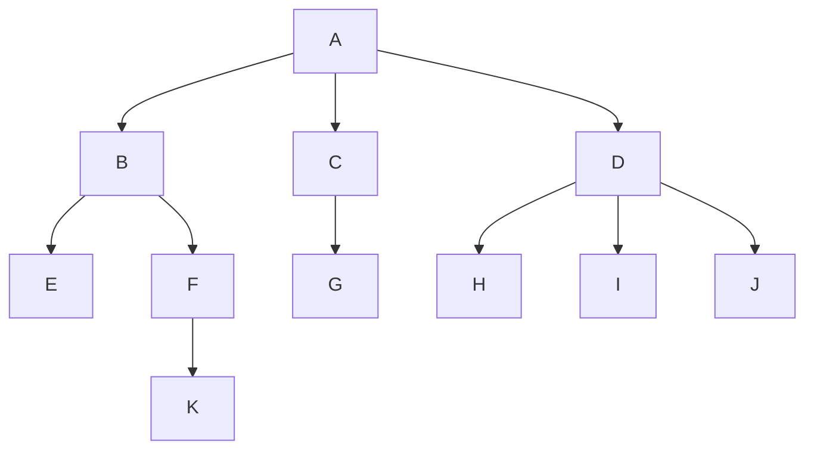
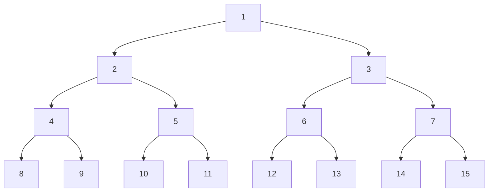
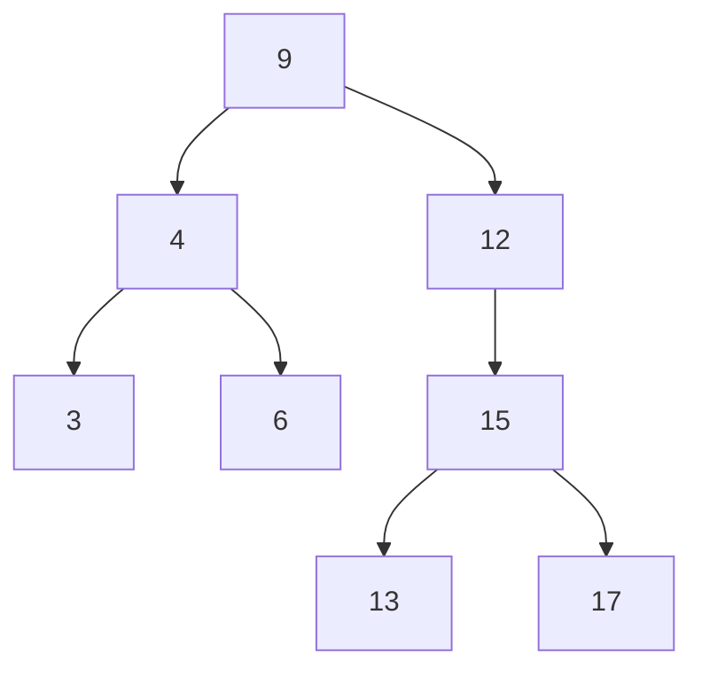

# 08. Tree

## 1. Tree

### 1. Tree의 특성

* Tree의 개념
  * 비선형 구조로 원소들 간에 1: n 관계를 가지는 자료구조
    1. 원소들 간에 계층관계를 가지는 계층형 자료구조
    2. 상위 원소에서 하위 원소로 내려가면서 확장되는 **Tree(나무)모양의 구조**

1. 한 개 이상의 노드로 이루어진 유한 집합
   * **루트(Root)** : 노드 중 최상위 노드
   * 나머지 노드들: n(>=0)개의 분리 집합 T1, ..., TN으로 분리될 수 있음
2. 이들 T1, ..., TN은 각각 하나의 트리가 되며(재귀적 정의) 루트의 **서브트리(SubTree)**라고 함

### 2. Tree의 구성요소

* 노드(node)
  * 트리의 원소
  * 트리 T의 노드: A, B, C, D, E, F, G, H, I, J, K
  * 루트노드(Root node)
    * 트리의 시작 노드
    * A
  * 형제 노드(Sibling node)
    * 같은 부모 노드의 자식 노드들
    * B, C, D / E, F / H, I, J
  * 조상 노드(Ancestor node)
    * 간선을 따라 루트 노드까지 이르는 경로에 있는 모든 노드들
    * K의 조상노드 : F, B, A
  * 서브트리(SubTree)
    * 부모 노드와 연결된 간선을 끊었을 때 생성되는 트리
    * B, E, F, K / C, G / D, H, I, J
  * 자손 노드(Descendent node)
    * 서브트리에 있는 하위 레벨의 노드들
    * B의 자손 노드 : E. F. K
* 간선(edge)
  * 노드를 연결하는 선
  * 부모 노드와 자식 노드를 연결
  * 트리 T의 간선: 간선AB, AC, AD, BE, BF, CG, DH, DI, DJ, FK
* 차수(degree)
  - 차수의 의미
    - 노드에 연결된 자식 노드의 수
    - B의 차수 = 2
    - C의 차수 = 1
  - 트리의 차수
    - 트리에 있는 노드의 차수 중에서 가장 큰 값
    - 트리 T의 차수 = 3 (D의 차수가 3)
  - 단말노드(리프 노드)
    - 차수가 0인 노드
    - 자식 노드가 없는 노드
    - E, K, G, H, I, J



* 높이
  1. 노드의 높이
     * **루트(Root)** : 노드 중 최상위 노드
     * 노드의 레벨
     * B의 높이 = 1(레벨 1)
     * G의 높이 = 2(레벨 2)
  2. 트리의 높이
     * 트리에 있는 노드의높이 중에서 가장 큰 값
     * 최대 레벨
     * 트리 T의 높이 = 3

## 2. Binary Tree

### 1. Binary Tree의 특징

* 이진 트리
  1. 모든 노드들이 2개의 서브트리를 갖는 특별한 형태의 트리
  2. 노드가 자식 노드를 최대한 2개 까지만 가질 수 있는 트리
     * 왼쪽 자식 노드(Left child node)
     * 오른쪽 자식 노드(Right child node)
  3. 이진 트리의 예

1. 레벨 i에서의 노드의 최대 개수는 2^i^개
2. 높이가 h인 이진 트리가 가질 수 있는 노드의 최소 개수는 (h+1)개, 최대 개수는 (2^h+1^-1)개가 됨



**트리의 높이 = 3** / 노드의 최소 개수(**3** + 1) = 4 / 노드의 최대 개수 = (2^3+1^-1) = 15

### 2. Binary Tree의 종류

* 포화 이진 트리(Full binary Tree)

  * 모든 레벨에 노드가 포화상태로 차 있는 이진 트리
    1. 최대의 노드 개수인(2^h+1^-1)의 노드를 가진 이진 트리
       * 예) 높이가 3일때: 2^3+1^-1 = 15개의 노드
    2. 루트를 1번으로 하여 2^h+1^-1까지 정해진 위치에 대한 노드 번호를 가짐

* 완전 이진 트리(Complete binary Tree)

  * 높이가 h이고 노드 수가 n개일 때 (e단, 2^h^ <= n < 2^h+1^-1), Full 이진 트리의 노드 번호 1번부터 n번까지 빈 자리가 없는 이진 트리

  * 노드가 10개인 완전 이진 트리

    ```mermaid
    graph TD
    1 --> 2
    2 --> 4
    4 --> 8
    4 --> 9
    5 --> 10
    1 --> 3
    3 --> 6
    3 --> 7
    ```

* 편향 이진 트리(Skewed binary Tree)

  * 높이 h에 대한 최소 개수의 노드를 가지면서 한쪽 방향의 자식 노드 만을 가진 이진 트리
  * 왼쪽, 오른쪽 편향 이진 트리

### 3. Binary Tree - 순회(traversal)

* 순회(Traversal)

  * 트리의 각 노드를 중복되지 않게 전부 방문(VIsit)하는 것을 말하는데, 트리는 비 선형 구조이기 때문에 선형구조에서와 같이 선후 연결 관계를 알 수 없음

* 3가지의 기본적인 순회방법

  * 전위 순회(Preorder traversal)
    * **VLR**
    * 자손노드보다 루트노드를 먼저 방문
  * 중위 순회(Inorder traversal)
    * **LVR**
    * 왼쪽 자손, 루트, 오른쪽 자손 순으로 방문
  * 후위 순회(Postorder traversal)
    * **LRV**
    * 루트노드보다 자손을 먼저 방문

* 전위 순회(Preorder traversal)

  * 수행방법

    1. 현재 노드 n을 방문하여 처리: V
    2. 현재 노드 n의 왼쪽 서브트리로 이동: L
    3. 현재 노드 n의 오른쪽 서브트리로 이동: R

    ```python
    def preorder_traverse(T): # 전위순회
        if T: # T is not None
            visit(T) # print(T.item)
            preorder_traverse(T.left)
            preorder_traverse(T.right)
    ```

    ```python
    def preorder_traverse(T):
        if T:
            print("%d" % T, end=' ')
            preorder_traverse(tree[T][0])
            preorder_traverse(tree[T][1])
    
    
    n = int(input())
    tree = [[0] * 2 for _ in range(n + 1)]
    
    templ = list(map(int, input().split()))
    
    for i in range(len(templ) // 2):
        parent, child = templ[i * 2], templ[i * 2 + 1]
        if not tree[parent][0] :
            tree[parent][0] = child
        else:
            tree[parent][1] = child
    
    preorder_traverse(1)
    print()
    ```

  * 전위 순회 트리

    * T0 : A / T1 : B, D, E, H, I / T2 : C, F, G / T3 : E, H, I

    ```mermaid
    graph TD
    A --> B
    B --> D
    B --> E
    E --> H
    E --> I
    A --> C
    C --> F
    C --> G
    ```

    * 순서1: T0 -> T1 -> T2
    * 순서2: A -> B, D(T3) -> C, F, G
    * 총 순서: A-B-D-E-H-I-C-F-G

* 중위 순회(Inorder traversal)

  * 수행 방법

    1. 현재 노드 n의 왼쪽 서브트리로 이동 : L

    2. 현재 노드 n을 방문하여 처리 : V

    3. 현재 노드 n의 오른쪽 서브트리로 이동 : R

       ```python
       def inorder_traverse(T): # 중위순회
           if T: # T is not None
               inorder_traverse(T.left)
               visit(T) # print(T.item)
               inorder_traverse(T.right)
       ```

       ```python
       def inorder_traverse(T):
           if T:
               inorder_traverse(tree[T][0])
               print("%d" % T, end=' ')
               inorder_traverse(tree[T][1])
       
       
       n = int(input())
       tree = [[0] * 2 for _ in range(n + 1)]
       
       templ = list(map(int, input().split()))
       
       for i in range(len(templ) // 2):
           parent, child = templ[i * 2], templ[i * 2 + 1]
           if not tree[parent][0] :
               tree[parent][0] = child
           else:
               tree[parent][1] = child
       
       inorder_traverse(1)
       print()
       ```

  * 중위 순회 트리

    * T0 : A / T1 : B, D, E, H, I / T2 : C, F, G / T3 : E, H, I

    ```mermaid
    graph TD
    A --> B
    B --> D
    B --> E
    E --> H
    E --> I
    A --> C
    C --> F
    C --> G
    ```

    * 순서1: T1 -> T0 -> T2
    * 순서2: D, B(T3) -> A -> F, C, G
    * 총 순서: D-B-H-E-I-A-F-C-G

* 후위 순회(Postorder traversal)

  * 수행 방법

    1. 현재 노드 n의 왼쪽 서브트리로 이동 : L

    2. 현재 노드 n의 오른쪽 서브트리로 이동 : R

    3. 현재 노드 n을 방문하여 처리 : V

       ```python
       def postorder_traverse(T): # 후위순회
           if T:                  # T is not None
               postorder_Traverse(T.left)
               postorder_traverse(T.right)
               visit(T)    # print(T.item)
       ```

       ```python
       def postorder_traverse(T):
           if T:
               postorder_traverse(tree[T][0])
               postorder_traverse(tree[T][1])
               print("%d" % T, end=' ')
       
       
       n = int(input())
       tree = [[0] * 2 for _ in range(n + 1)]
       
       templ = list(map(int, input().split()))
       
       for i in range(len(templ) // 2):
           parent, child = templ[i * 2], templ[i * 2 + 1]
           if not tree[parent][0] :
               tree[parent][0] = child
           else:
               tree[parent][1] = child
       
       postorder_traverse(1)
       print()
       ```

  * 후위 순회 트리

    * T0 : A / T1 : B, D, E, H, I / T2 : C, F, G / T3 : E, H, I

    ```mermaid
    graph TD
    A --> B
    B --> D
    B --> E
    E --> H
    E --> I
    A --> C
    C --> F
    C --> G
    ```

    * 순서1: T1 -> T2 -> T0
    * 순서2: D(T3) B -> F, G, C -> A
    * 총순서: D-H-I-E-B-F-G-C-A

* 이진 트리 순회방법 비교

  ```mermaid
  graph TD
  A --> B
  B --> D
  D --> H
  D --> I
  B --> E
  A --> C
  C --> F
  C --> G
  G --> J
  ```

  * 프리오더(Preorder) 전위순회
    * 각 정점 왼쪽의 파란색 점은 프리오더(Preorder)의 전위순회 순서
    * ABDHIECFGJ
  * 인오더(Inorder)중위순회
    * 각 정점 아래쪽의 초록색 점은 인오더(Inorder)의 중위순회 순서
    * HDIBEAFCJG
  * 포스트오더(Postorder) 후위순회
    * 각 정점 오른쪽의 주황색 점은 포스트오더(Postorder)의 후위순회 순서
    * HIDEBFHGCA

## 3. Expression Tree

### 1. List를 이용한 Binary Tree의 표현

* 리스트를 이용한 이진 트리의 표현
  1. 이진 트리에 각 노드 번호를 다음과 같이 부여
  2. 루트의 번호를 1로 함
  3. 레벨 n에 있는 노드에 대하여 왼쪽부터 오른쪽으로 2n 부터 2^n+1^ - 1까지 번호를 차례로 부여
* 노드 번호의 성질
  1. 노드 번호가 i인 노드의 부모 노드 번호? [i/20]
  2. 노드 번호가 i인 노드의 왼쪽 자식 노드 번호? 2*i
  3. 노드 번호가 i인 노드의 오른족 자식 노드 번호? 2*i + 1

1. 노드 번호를 리스트의 인덱스로 사용

2. 높이가 h인 이진 트리를 위한 리스트의 크기는?

   * 레벨 i의 최대 노드 수는? 2^i^
   * 따라서 1 + 2+ 4+ 8 ... + 2^i^ = $\sum2^{i} = 2^{h+1}-1$

* 리스트를 이용한 편향 이진 트리 표현
  * 왼쪽편향
    * \- A B \- C \- \- \- D \- \- \- \- \- \- \-
  * 오른쪽편향
    * \- A B \- \- \- \- C \- \- \- \- \- \- \- D
* 리스트를 이용한 이진 트리 표현의 단점
  * 단점
    * 편향 이진 트리의 경우에 사용하지 않는 리스트 원소에 대한 메모리 공간 낭비 발생
  * 이진 트리의 단점 보완
    1. 연결 리스트를 이용하여 트리를 표현
       * 리스트를 이용한 이진 트리 표현의 단점 보완
    2. 연결 자료구조를 이용한 이진 트리의 이해와 표현
       * 이진 트리의 모든 노드는 최대 2개의 자식 노드를 가지므로 일정한 구조의 단순 연결 List 노드를 사용하여 구현
* 완전 이진 트리의 연결 리스트 표현

## 4. Binary search Tree

### 1. Binary search Tree의 특징

1. 탐색작업을 효율적으로 하기 위한 자료구조
2. 모든 원소는 서로 다른 유일한 키를 가짐
3. key(왼쪽 서브트리) < key(루트 노드) < key(오른쪽 서브트리)
4. 왼쪽 서브트리와 오른쪽 서브트리도 이진 탐색 트리임
5. 중위 순회하면 오름차순으로 정렬된 값을 얻을 수 있음

* 탐색 연산
  1. 루트에서 시작
  2. 탐색할 키값 x를 루트 노드의 키 값과 비교
     * 키값 x = 루트 노드의 키값 : 원하는 원소를 찾았으므로 탐색 연산 성공
     * 키값 x < 루트 노드의 키값 : 루트 노드의 왼쪽 서브트리에 대해서 탐색 연산 수행
     * 키값 x > 루트 노드의 키값 :  루트 노드의 오른쪽 서브트리에 대해서 탐색 연산 수행
  3. 서브트리에 대해서 순환적으로 탐색 연산을 반복
* 13탐색



1. 13 > 9
2. 13 > 12
3. 13 < 15
4. 13 = 13

* 삽입 연산
  1. 먼저 탐색 연산을 수행
     * 삽입할 원소와 같은 원소가 트리에 있으면 삽입할 수 없으므로, 같은 원소가 트리에 있는지 탐색하여 확인
     * 탐색에세 탐색 실패가 결정되는 위치가 삽입 위치가 됨
  2. 탐색 실패한 위치에 원소를 삽입

### 3. Binary search Tree의 성능

1. 탐색(searching), 삽입(insection), 삭제(deletion) 시간은 트리의 높이에 좌우 됨
   * O(h) , h : BST의 깊이(height)
2. 평균의 경우
   * 이진 트리가 균형적으로 생성되어 있는 경우
   * O(log n)
3. 최악의 경우
   * 한쪽으로 치우친 경사 이진 트리의 경우
   * O(n)
   * 순차탐색과 시간복잡도가 같음

* 검색 알고리즘 비교
  1. 리스트에서의 순차 검색: O(N)
  2. 정렬된 리스트에서의 순차 검색: O(N)
  3. 정렬된 리스트에서의 이진 검색: O(logN)
  4. 이진 탐색 트리에서의 평균: O(logN)
     * 최악의 경우: O(N)
     * 완전 이진 트리 또는 균형 트리로 바꿀 수 있다면 최악의 경우를 없앨 수 있음
       * 새로운 원소를 삽입할 때 삽입 시간을 줄임
       * 평균과 최악의 시간이 같음 O(logn)
  5. 해쉬 검색: O(1)

## 5. Heap

### 1. Heap의 특징

* Heap

  * 완전 이진 트리에 있는 노드 중에서 키값이 가장 큰 노드나 키값이 가장 작은 노드를 찾기 위해서 만든 자료구조

  * 최대 힙(Max heap)

    * 키값이 **가장 큰 노드를 찾기 위한 완전 이진 트리**
    * {부모 노드의 키값 > 자식 노드의 키값}
    * 루트노드 : 키값이 가장 큰 노드
    * 예

    ```mermaid
    graph TD
    
    33 --> 31
    31 --> 21
    21 --> 14
    21 --> 19
    31 --> 22
    33 --> 27
    27 --> 18
    27 --> 23
    ```

  * 최소 힙(Min heap)

    * 키값이 **가장 작은 노드를 찾기 위한 완전 이진 트리**
    * {부모 노드의 키값 < 자식노드의 키값}
    * 루트노드: 키값이 가장 작은 노드
    * 예

    ```mermaid
    graph TD
    15 --> 16
    16 --> 26
    26 --> 33
    26 --> 37
    16 --> 29
    15 --> 18
    18 --> 25
    18 --> 22
    ```

### 2. Heap의 연산

  * 힙이 아닌 이진 트리의 예

  ```mermaid
  graph TD
  8 --> 6
  6 --> 4
  4 --> 5
  8 --> 5
  5 --> 1
  ```

  ```mermaid
  graph TD
  8 --> 11
  11 --> 4
  11 --> 11
  8 --> 7
  7 -->14
  ```

  **키의 배치가 힙의 정의에 맞지 않음**

* 예) 삽입 연산: 17 삽입

  * 삽입 전의 힙
  * 삽입 할 자리 확장
  * 확장한 자리에 삽입할 원소 저장

* 예) 삽입 연산: 23 삽입

  1. 비어 있는 곳에 임시로 23 삽입
  2. 부모 노드 19와 위치 바꾸기
  3. 부모 노드 20과 위치 바꾸기
  4. 자리 확정

* 삭제 연산
  1. 힙에서는 **루트 노드의 원소만을 삭제**할 수 있음
  2. 루트 노드의 원소만을 삭제하여 반환
  3. 힙의 종류에 따라 **최대값 또는 최소값**을 구현할 수 있음
     * 이를 이용하여 우선순위 큐를 힙으로 구현할 수 있음
* 힙에서의 삭제
  1. 루트 노드의 원소 삭제
  2. 마지막 노드를 루트 노드 위치로 이동
  3. 삽입 노드 10 < 자식 노드 19  비교하여 자리 바꾸기
  4. 자리 확정