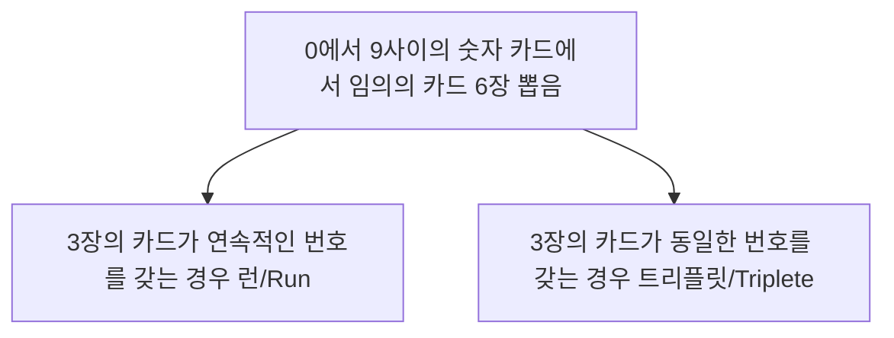

# 정리

## Stack

### 1. 메모이제이션(Memoization)

* 컴퓨터 프로그램을 실행할 때 이전에 계산한 값을 메모리에 저장해서 매번 다시 계산하지 않도록 하여 전체적인 실행속도를 빠르게 하는 기술

* DP(동적계획법)의 핵심이 되는 기술

* 예시-피보나치수열

  ```python
  ## 재귀함수
  def fibo(n):
      if n < 2:
          return n
      else:
          return fibo(n-1) + fibo(n-2)
      
  ## Memoization방법 적용
  # memo를 위한 리스트를 생성하고
  # memo[0]을 0으로 memo[1]는 1로 초기화
  
  def fibo1(n):
      global memo
      if n >= 2 and len(memo) <= n:
          memo.append(fibo1(n-1) + fibo1(n-2))
      return memo[n]
  
  memo = [0, 1]
  ```

### 2. DP(동적계획법, Dynamic Programming)

* 그리디 알고리즘과 같이 **최적화** 문제를 해결하는 알고리즘

* 입력 크기 작은 부분 문제 해결 후, 그 해들을 이용하여 보다 큰 크기의 부분문제들 해결 => 최종적으로 원래 주어진 입력의 문제를 해결

* 예시-피보나치수열

  ```python
  ## 피보나치 수를 DP에 적용한 알고리즘
  def fibo2(n):
      f = [0, 1]
      
      for i in range(2, n+1):
          f.append(f[i-1] + f[i-2])
          
      return f[n]
  ```

  * DP의 구현방식
    * recursive 방식 - fibo1() : 재귀적 구조는 내부에 시스템 호출 스택을 사용하는 **overhead**가 발생할 수 있음
    * iterative 방식 - fibo2() : Memoization을 재귀적 구조에 사용하는 것보다 반복적 구조로 DP를 구현한 것이 **성능 면에서 보다 효율적**

### 3. DFS(깊이 우선 탐색)

* 방법

  * 시작 정점의 한 방향으로 갈 수 있는 경로가 있는 곳까지 깊이 탐색
  * 더 이상 갈 곳이 없게 되면, 가장 마지막에 만났던 갈림길 간선이 있는 정점으로 되돌아옴
  * 다른 방향의 정점으로 탐색을 계속 반복하여 결국 모든 정점을 방문하여 순회

* 후입선출 구조의 스택을 사용

* 알고리즘

  ```mermaid
  graph TD
  A[시작 정점 v를 결정하여 방문] --- B[1. 정점 v에 인접한 정점 중에서]
  B --- C[방문하지 않은 정점 w가 있으면,<br>정점 v를 스택에 push하고<br>정점 w를 방문]
  B --- D[방문하지 않은 정점이 없으면,<br>탐색의 방향을 바꾸기 위해서<br>스택을 pop하여 받은<br>가장 마지막 방문 정점을 v로 하여<br>다시 1을 반복]
  C --- E[w를 v로 하여 다시 1을 반복]
  ```

  ```python
  visited[], stack[] 초기화
  def DFS(v):
  	v 방문
  	visited[v] = True
  	while v:
          if (v의 인접 정점 중 방문 안한 w 찾기):
              push(w)
          while w:
              w 방문
              visited[w] = True
              push(w)
              v = w
              v의 인접 정점 중 방문 안한 w 찾기
          v = stack.pop()
  ```

### 4. 계산기

* 중위 표기법의 수식을 후위 표기법으로 변경하여 스택을 이용하여 계산

1. 중위표기식의 후위표기식으로 변환알고리즘
   1. 입력 받은 중위표기식에서 토큰을 읽음
   2. 토큰이 피연산자이면 토큰을 출력
   3. 토튼이 연산자(괄호포함)일 경우
      * 우선순위가 높으면 -> 스택에 push
      * 우선순위가 안 높으면 -> 연산자의 우선순위가 토큰의 우선순위보다 작을 때까지 스택에서 pop한 후 토큰의 연산자를 push
   4. 토큰이 오른쪽 괄호 ')'일 경우
      * 스택 top에 왼쪽 괄호 '('가 올 때까지 스택에 pop 연산을 수행
      * pop한 연산자를 출력
      * 왼쪽 괄호를 만나면 pop만 하고 출력하지는 않음
   5. 중위표기식에 더 읽을 것이 없다면 중지,  더 읽을 것이 있다면 1부터 반복
   6. 스택에 남아 있는 연산자를 모두 pop하여 출력
      * 스택 밖의 왼쪽 괄호는 우선 순위가 가장 높으며, 스택 안의 왼쪽 괄호는 우선 순위가 가장 낮음
2. 후위표기법의 수식을 스택을 이용하여 계산
   1. **피연산자를 만나면 스택에 push함**
   2. 연산자를 만나면 필요한 만큼의 피연산자를 스택에서 pop하여 연산하고, 연산결과를 다시 스택에 push함
   3. 수식이 끝나면, 마지막으로 스택을 pop하여 출력

* **eval(수식)**

  * 문자열로 된 수식을 계산

  * Eva;iation = "값을 구함"이라는 뜻

  * 올바른 수식이 아닌 경우 SyntaxError 예외가 발생함

    예) `print(eval("6+5*(2-8)/2"))` `# -9.0`

### 5. 백트래킹(Backtracking)

* 해를 찾는 도중에 '막히면', (즉, 해가 아니면) 되돌아가서 다시 해를 찾아가는 기법

* 최적화(Optimazation) + 결정(Decision)

* 백트래킹과 깊이 우선 탐색의 차이

  |                           백트래킹                           |                        깊이 우선 탐색                        |
  | :----------------------------------------------------------: | :----------------------------------------------------------: |
  | 어떤 노드에서 출발하는 경로가 해결책으로 이어질 것 같지 않으면 더 이상 그 경로를 따라가지 않음으로써 **시도의 횟수를 줄임** |                       모든 경로를 추적                       |
  |                      가지치기(Prunning)                      | 경우의 수가 너무 많은 경우 **처리 불가능** <br>- `N!` 가지의 경우의 수를 가진 문제에 대해 깊이 우선 탐색을 가하면 **처리 불가능한 문제** |
  |                  불필요한 경로의 조기 차단                   |                       모든 후보를 검사                       |
  | **백트래킹 알고리즘 적용**으로(`N!` 가지의 경우의 수를 가진 문제에 대해 백트레킹에 가하면) 일반적으로 **경우의 수가 줄어들지만** 이 역시 최악의 경우에는 여전히 지수함수 시간(Exponential Time)을 요하므로 처리 불가능 |                                                              |

* 백트래킹을 이용한 알고리즘 절차

  ```mermaid
  graph TD
  A[상태 공간 Tree의 깊이 우선 검색을 실시] --> B[각 노드가 유망한지를 점검]
  B --> C[만일 그 노드가 유망하지 않으면, 그 노드의 부모 노드로 돌아가서 검색을 계속]
  ```

  * 일반 백트래킹 알고리즘

    * `n*n`의 정사각형 안에 n개의 queen을 배치하는 문제로 모든 queen은 자신의 일직선상 및 대각선상에 아무 것도 놓이지 않아야 함

      ```python
      def checknode(v): # node
          if promising(v):
              if there is a solution at v:
                  write the solution
              else:
                  for u in each child of v:
                      checknode(u)
      ```

* Power Set

  * 어떤 집합의 공집합과 자기자신을 포함한 모든 부분집합

  * 구하고자 하는 어떤 집합의 원소 개수가 n일 경우 부분집합의 개수는 2^n^이 나옴

  * Power Set을 구하는 백트래킹 알고리즘

    * 일반적인 백트래킹 접근 방법 이용

    * n개의 원소가 들어있는 집합의 2^n^개의 부분집합을 만들 때, True 또는 False값을 가지는 항목들로 구성된 n개의 리스트를 만드는 방법 이용

    * 리스트의 i번째 항목은 i번째의 원소가 부분집합의 값인지 아닌지를 나타내는 값

      ```python
      def backtrack(a, k, input):
          global MAXCANDIDATES
          c = [0] * MAXCANDIDATES
          
          if k == input:
              process_solution(a, k) # 답이면 원하는 작업을 한다.
          else:
          k += 1
          ncandidates = construct_candidates(a, k, input, c)
          for i in range(ncandidates):
              a[k] = c[i]
              backtrack(a, k, input)
      def construct_Candidate(a, k, input, c):
          c[0] = True
          c[1] = False
          return 2
      
      MAXCANDIDATES = 100
      NMAX = 100
      a = [0] * NMAX
      backtrack(a, 0, 3)
      ```

    * 부분집합의 상태 공간 트리

      ```python
      # 깊이 우선 탐색으로 모든 부분집합 생성 알고리즘
      
      ## a[0...n-1] : 집합에 대한 비트 표현 저장, 크기는 원소의 수
      ## k : 선택한 횟수(현재 노드의 높이), n : 모든 선택수(트리의 높이)
      
      def subset(a, k, n):
          if k == n:
              process_solution(a, n)
          else:
              a[k] = 0
              subset(a, k+1, n)
              a[k] = 1
              subset(a, k+1, n)
      ```

* 순열  

    * 순열에 대한 상태 공간 트리

        * 원소 개수 n = 4 / 집합 = {A, B, C, D}

            ```mermaid
            graph TD
            A[start] --- B[0]
            A --- C[1]
            C --- a[...]
            A --- D[2]
            D --- b[...]
            A --- E[3]
            E --- ...
            B --- F[1]
            B --- G[2]
            B --- H[3]
            F --- I[2]
            F --- J[3]
            I --- O[3]
            O --- 0123/ABCD
            J --- P[2]
            P --- 0132/ABDC
            G --- K[1]
            G --- L[3]
            K --- Q[3]
            Q --- 0213/ACBD
            L --- R[1]
            R --- 0231/ACDB
            H --- M[1]
            H --- N[2]
            M --- S[2]
            S --- 0312/ADBC
            N --- T[1]
            T --- 0321/ADCB
            ```

        * 노드 방문 시마다 저장 내용은 원소를 가리키는 인덱스 값 저장

        * 같은 원소 수를 가지는 집합에 대해 **부분집합과 순열의 상태 공간 트리 높이 같음**

        * 순열의 경우는 높이가 다른 노드들은 선택지의 수가 동일하지 않음

        * **높이가 증가하면서 선택지의 수 하나싹 감소**

    * 모든 순열 생성 알고리즘

        ```python
        # order[] : 순열의 순서를 저장하는 리스트
        def permutation(order, k, n):
            if k == n:
                print_order_array(order, n)
            else:
                check = [False] * n
                for i in range(k):
                    check[order[i]] = True
                    
                for i in range(n):
                    if check[i] == False:
                        order[k] = i
                        permutation(order, k+1, n)
        ```

    * 순열을 구하는 백트래킹 알고리즘

      ```python
      def backtrack(a, k, input):
          global MAXCANDIDATES
          c = [0] * MAXCANDIDATES
          
          if k == input:
              for i in range(1, k+1):
                  print(a[i], end=" ")
              print()
          else:
          k += 1
          ncandidates = construct_candidates(a, k, input, c)
          for i in range(ncandidates):
              a[k] = c[i]
              backtrack(a, k, input)
      def construct_candidates(a, k, input, c):
          in_perm = [False] * NMAX
          
          for i in range(1, k):
              in_perm[a[i]] = True
              
          ncandidates = 0
          for i in range(1, input+1):
              if in_perm[i] == False:
                  c[ncandidates]=i
                  ncandidates+= 1
          return ncandidates
      ```

* 동전 거스름돈 문제

    * 상태 공간 트리

        ```mermaid
        graph TD
        A[800] --- B[500]
        B --- C[300]
        C --- D[100]
        D --- E[200]
        E --- F[100]
        F --- G[100]
        G --- H[100]
        H --- a[0]
        E --- 150
        E --- 190
        C --- 250
        C --- 290
        A --- I[400]
        I --- J[400]
        J --- 0
        A --- K[100]
        K --- 700
        A --- L[50]
        L --- 750
        A --- M[10]
        M --- 790
        
        
        ```

    * 예제 코드

        ```python
        # coin[] : 동전의 금액을 저장, choice[] : 선택한 동전들 집합
        # best : 거스름돈에 대한 최소 동전 개수
        def CoinChange(choice, N, money):
            global best
            if best <= N:
                return
            elif money == 0:
                best = N
            else:
                for i in range(len(coin)):
                    if money - coin[i] >= 0:
                        choice[N] = coin[i]
                        CoinChange(choice, N+1, money-coin[i])
        ```

### 6. 분할 정복

| 분할(Divide)                                   | 정복(Conquer)                  | 통합(Combine)                       |
| ---------------------------------------------- | ------------------------------ | ----------------------------------- |
| 해결할 문제를 **여러 개의 작은 부분**으로 나눔 | 나눈 작은 문제를 **각각 해결** | (필요하다면) 해결된 **해답을 모음** |

* 분할 정복 알고리즘

  ```python
  # 거듭 제곱(Exponentiation) 알고리즘: O(n)
  def Power(Base, Exponent):
      if Base == 0: return 1
      result = 1 # Base^0은 1이므로
      for i in range(Exponent):
          result *= Base
      return result
  
  # 분할 정복 기반의 알고리즘: O(log2n)
  def Power(Base, Exponent):
      if Exponent == 0 or Base == 0:
          return 1
      if Exponent % 2 == 0:
          NewBase = Power(Base, Exponent/2)
          return NewBase * NewBase
      else:
          NewBase = Power(Base, (Exponent-1)/2)
          return (NewBase * NewBase) * Base
  ```

* 이진 검색(Binary Search)

  * 자료의 가운데에 있는 항목의 키 값과 비교하여 다음 검색의 위치를 결정하고 검색을 계속 진행하는 방법

    * 목적 키를 찾을 때까지 이진 검색을 순환적으로 반복 수행해 검색 범위를 반으로 줄여가면서 보다 빠르게 검색 수행

  * 이진 검색을 위해서 자료 정렬 상태 필요

  * 검색과정

    1. 자료의 중앙에 있는 원소를 고른다.
    2. 중앙 원소의 값과 찾고자 하는 목표 값을 비교한다.
    3. 목표 값과 중앙 원소 값의 관계
       * **목표 값 < 중앙 원소 값**
         * 자료의 왼쪽 반에 대해서 새로 검색 수행
       * **목표 값 > 중앙 원소 값**
         * 자료의 오른쪽 반에 대해서 새로 검색 수행
    4. 찾고자 하는 값을 찾을 때까지 1~3의 과정 반복

  * 알고리즘

    * 반복구조

      * 이진 검색의 경우: 자료 삽입/삭제 발생시 리스트의 상태를 항상 정렬 상태로 유지하는 **추가 작업 필요**

      ```python
      # a : 검색할 리스트
      # key : 검색하고자 하는 값
      
      def binarySearch(a, key):
          start = 0
          end = len(a) - 1
          while start <= end:
              middle = start + (end - start) // 2
              if key == a[middle]: # 검색 성공
                  return middle
              elif key < a[middle]:
                  end = middle - 1
              else: # a[middle] < key:
                  start = middle + 1
          return -1 # 검색 실패
      ```

    * 재귀 구조

      ```python
      # a : 검색할 리스트
      # key : 검색하고자 하는 값
      
      def binarySearch2(a, low, high, key):
          if low > high: # 검색 실패
              return -1 # 검색 실패 False
          else:
              middle = (low + high) // 2
              if key == a[middle]: # 검색 성공
                  return middle
              elif key < a[middle]:
                  return binarySearch2(a, low, middle-1, key)
              else: # a[middle] < key:
                  return binarySearch2(a, middle-1, high, key)
      ```

## Queue


  ### 1. 선형 Queue

  1. 초기 createQueue()

     * 초기 공백큐 생성
       * 크기 n인 1차원 리스트 생성
       * front, rear  = -1로 초기화

  2. enQueue(item)

     * 삽입

       * 마지막 원소 뒤에 새로운 원소를 삽입하기 위해

         1. rear 값을 하나 증가시켜 새로운 원소를 삽입할 자리를 마련함

         2. 그 인덱스에 해당하는 리스트원소 Q[rear]에 item을 저장

            ```python
            def enQueue(item):
                global rear
                if isFull(): print("Queue_Full")
                else:
                    rear += 1
                    Q[rear] = item
            ```

  3. deQueue

     * 삭제

       * 가장 앞에 있는 원소를 삭제하기 위해

         1. front 값을 하나 증가시켜 큐에 남아있는 첫 번째 원소로 이동함

         2. 새로운 첫 번째 원소를 리턴함으로써 삭제와 동일한 기능을 함

            ```python
            def deQueue():
                global front
                if isEmpty(): print("Queue_Empty")
                else:
                    front += 1
                    return Q[front]
            ```

  4. isEmpty(), isFull()

     * 공백상태 및 포화상태 검사

       * 공백상태: front = rear

       * 포화상태: rear = n-1

         (n: 리스트의 크기, n-1: 리스트의 마지막 인덱스)

       ```python
       def isEmpty():
           return front == rear
       
       def isFull():
           return rear == len(Q)-1
       ```

  5. Qpeek()

     * 검색

       * 가장 앞에 있는 원소를 검색하여 반환하는 연산
       * 현재 front의 한자리 뒤(front +1)에 있는 원소, 즉 큐의 첫 번째에 있는 원소를 반환

       ```python
       def Qpeek():
           if isEmpty(): print("Queue_Empty")
           else: return Q[front+1]
       ```

  ### 2. 원형 Queue

* 1차원 리스트를 사용하되, 논리적으로 리스트의 처음과 끝이 연결되어 원형 형태의 큐를 이룬다고 가정하고 사용함

* 특징

  1. 초기 공백 상태

     * front = rear = 0

  2. Index의 순환

     * front와 rear의 위치가 리스트의 마지막 인덱스인 n-1를 가리킨 후, 논리적 순환을 이루어 리스트의 처음 인덱스인 0으로 이동해야 함
     * 이를 위해 나머지 연산자 %를 사용

  3. front 변수

     * 공백 상태와 포화 상태 구분을 쉽게 하기 위해 front가 있는 자리는 사용하지 않고 항상 빈자리로 둠

  4. 삽입 위치 및 삭제 위치

     | 테이블 인덱스 | 삽입 위치             | 삭제 위치               |
     | ------------- | --------------------- | ----------------------- |
     | 선형 큐       | rear = rear + 1       | front = front + 1       |
     | 원형 큐       | rear = (rear + 1) % n | front = (front + 1) % n |

1. 초기 createQueue()

   * 초기 공백큐 생성
     - 크기 n인 1차원 리스트 생성
     - front, rear = 0으로 초기화

2. isEmpty(), isFull()

   - 공백상태 및 포화상태 검사
     - 공백상태 : front = rear
     - 포화상태 : 삽입할 rear의 다음 위치 = 현재 front
     - (rear + 1) % n = front

     ```python
     def isEmpty():
         return front == rear
     
     def isFull():
         return (rear+1)%len(cQ) == front
     ```

3. enQueue(item)

   - 삽입

     - 마지막 원소 뒤에 새로운 원소를 삽입하기 위해

       1. rear 값을 조정하여 새로운 우너소를 삽입할 자리에 마련함: 

          rear <- (rear + 1) % n;

       2. 인덱스에 해당하는 리스트원소 cQ[rear]에 item을 저장

       ```python
       def enQueue(item):
           global rear
           if isFull():
               print("Queue_Full")
           else:
               rear = (rear + 1) % len(cQ)
               cQ[rear] = item
       ```

4. deQueue(), delete()

   - 삭제
     - 가장 앞에 있는 원소를 삭제하기 위해
       1. front 값을 조정하여 삭제할 자리를 준비함
       2. 새로운 front 원소를 리턴함으로써 삭제와 동일한 기능을 함

       ```python
       def deQueue():
           global front
           if isEmpty():
               print("Queue_Empty")
           else:
               front = (front + 1) % len(cQ)
               return cQ[front]
           
       def delete():
           global front
           if isEmpty():
               print("Queue_Empty")
           else:
               front = (front + 1) % len(cQ)
       ```

5. 파이썬으로 구현한 원형 큐의 삽입 및 삭제 함수

   ```python
   def enQueue(item):
       queue.append(item)
       
   def deQueue():
       if isEmpty():
           print("Queue_Empty")
       else:
           return queue.pop(0)
   
   def isEmpty():
       return len(queue) == 0
   
   def Qpeek():
       if isEmpty():
           print("Queue_Empty")
       else:
           return queue[0]
       
   queue = [] # 공백 리스트 생성
   # front : -1
   # rear : len(queue) -1
   
   enQueue('A')
   enQueue('B')
   enQueue('C')
   print(deQueue())
   print(deQueue())
   print(deQueue())
   ```

### 3. 연결 Queue

* 특징
  1. 단순 연결 리스트(Linked List)를 이용한 큐
     * 큐의 원소: 단순 연결 리스트의 노드
     * 큐의 원소 순서: 노드의 연결 순서, 링크로 연결되어 있음
     * front: 첫 번째 노드를 가리키는 링크
     * rear: 마지막 노드를 가리키는 링크
  2. 상태 표현
     * 초기 상태: front = rear = **None**
     * 공백 상태 : front = rear = **None**

1. createLinkedQueue()

   - 초기 공백 큐 생성
     - 리스트 노드 없이 포인터 변수만 생성함
     - front와 rear를 None로 초기화

     ```python
     front = None
     rear = None
     ```

2. isEmpty()

   - 공백상태 검사

     - 공백상태: front = rear = None

     ```python
     def isEmpty():
         return front == None
     ```

3. enQueue(item)

   - 삽입
     1. 새로운 노드 생성 후 데이터 필드에 item 저장
     2. 연결 큐가 공백인 경우, 아닌 경우에 따라 front, rear 변수 지정

     ```python
     def enQueue(item): # 연결 큐의 삽입 연산
         global front, rear
         newNode = Node(item) # 새로운 노드 생성
         if isEmpty(): # 큐가 비어있다면
             front = newNode
         else:
             rear.next = newNode
         rear = newNode
     ```

4. deQueue()

   - 삭제
     1. old가 지울 노드를 가리키게 하고, front 재설정
     2. 삭제 후 공백 큐가 되는 경우, rear도 None 로 설정
     3. old가 가리키는 노드를 삭제하고 메모리 반환

     ```python
     def deQueue(): # 연결 큐의 삭제 연산
         global front, rear
         if isEmpty():
             print("Queue_Empty")
             return None
         itemp = front.item
         front = front.next
         if isEmpty():
             rear = None
         reeturn item
     ```

5. 파이썬으로 구현한 연결 큐

   ```python
   class Node:
       def __init__(self, item, n=None):
           self.item = item
           self.next = n
           
       def enQUeue(item): # 연결 큐의 삽입 연산
           global front, rear
           newNode = Bode(item) # 새로운 노드 생성
           if front == None: # 큐가 비어있다면
               front = newNode
           else:
               rear.next = newNode
           rear = newNode
           
       def isEmpty():
           return front == None
       
       def deQueue(): # 연결 큐의 삭제 연산
           global front, rear
           if isEmpty():
               print("Queue_Empty")
               return None
           item = front.item
           front = front.next
           if front == None:
               rear = None
           return item
       
       def Qpeek():
           return front.item
       
       def printQ():
           f = front
           s = ""
           while f:
               s += f.item + " "
               f = f.next
           return s
       
   front = None
   rear = None
   
   enQueue('A')
   enQueue('B')
   enQueue('C')
   printQ()
   print(deQueue())
   print(deQueue())
   print(deQueue())
   ```

### 4. Queue 라이브러리

1. queue 모듈

   1. 큐 모듈에 정의된 클래스 

      | 클래스                       | 내용                                                         |
      | ---------------------------- | ------------------------------------------------------------ |
      | queue.Queue(maxsize)         | 선입선출(FIFO First-In, First-Out)큐 객체를 생성             |
      | queue.LifoQueue(maxsize)     | 스택(Stack)개념의 후입선출(LIFO Last-In, First-Out)큐 객체 생성 |
      | queue.PriorityQueue(maxsize) | 우선순위 큐 객체를 생성, 입력되는 아이템의 형식은 (순위, 아이템)의 튜플로 입력되며, 우선순위는 숫자가 작을수록 높은 순위를 가짐 |

   2. maxsize는 최대 아이템수, 지정하지 않거나 음수이면 내용만큼 늘어남

   3. 제시된 3개의 클래스는 다음과 같은 메서드를 동일하게 가짐

      | 메서드                        | 내용                                            |
      | ----------------------------- | ----------------------------------------------- |
      | qsize()                       | 큐 객체에 입력된 아이템의 개수를 반환           |
      | put(item[, block[, timeout]]) | 큐 객체에 아이템을 입력                         |
      | get([block[, timeout]])       | 생성된 큐 객체 특성에 맞추어, 아이템 1개를 반환 |
      | empty()                       | 큐 객체가 비어있으면 True 리턴                  |
      | full()                        | 큐 객체가 꽉차있으면 True 리턴                  |

   4. 클래스의 정렬방식에 따라 get 계열의 메서드 결과가 달라짐

2. 활용

   * 선입선출의 큐 개념을 구현한 큐 클래스 활용

     ```python
     import queue
     
     q = queue.Queue() # FIFO 구조 큐 생성
     q.put('A')
     q.put('B')
     q.put('C')
     
     while not q.empty():
         print(q.get())
     ```

### 5. 활용

#### 1. 우선순위 큐

* 우선순위를 가진 항목들을 저장하는 큐

* FIFO 순서가 아니라 **우선순위가 높은 순서대로** 먼저 나가게 됨

* 리스트를 이용한 우선순위 큐의 구현

  1. 리스트를 이용하여 자료 저장
  2. 원소를 삽입하는 과정에서 우선순위를 비교하여 적절한 위치에 삽입하는 구조
  3. 가장 앞에 최고 우선순위의 원소가 위치하게 됨

  * 삽입/삭제 연산에서 원소의 재배치 발생/ 소요되는 시간 많이 걸림 

    => PriorityQueue(maxsize)클래스/힙 자료구조 사용

#### 2. 버퍼

* 데이터를 한 곳에서 다른 한 곳으로 전송하는 동안 일시적으로 그 데이터르 ㄹ보관하는 메모리의 영역
* 버퍼링 : 버퍼를 활용하는 방식 또는 버퍼를 채우는 동작을 의미
* 버퍼의 자료 구조
  * 일반적으로 입출력 및 네트워크와 관련된 기능에서 이용
  * 순서대로 입력/출력/전달되어야 하므로 FIFO 방식의 자료구조인 **큐가 활용**됨

### 6. BFS(너비 우선 탐색)

* 시작점의 인접한 정점들을 모두 차례로 방문한 후 방문했던 정점을 시작점으로하여 다시 인접한 정점들을 차례로 방문하는 방식

* 선입선출 형태의 자료구조인 큐 활용

* BFS 알고리즘

  * 입력 파라미터: 그래프 G와 탐색 시작점 v

  ```python
  def BFS(G, v): # 그래프 G, 탐색 시작점 v
      visited = [0]*n # n : 정점의 개수
      queue = [] # 큐 생성
      queue.append(v) # 시작점 v를 큐에 삽입
      while queue: # 큐가 비어있지 않은 경우
          t = queue.pop(0) # 큐의 첫번째 원소 반환
          if not visited[t]: # 방문되지 않은 곳이라면
              visited[t] = True # 방문한 것으로 표시
              visit(t)
          for i in G[t]: # t와 연결된 모든 선에 대해
              if not visited[i]: # 방문되지 않은 곳이라면
                  queue.append(i) # 큐에 넣기
  ```

## Linked List

* 개념

  * 순서를 가진 데이터의 묶음 - 같은 데이터의 중복 저장 가능
  * 시퀀스 자료형 - 인덱싱, 슬라이싱, 연산자, 메서드 사용 가능
  * 크기제한 없음, 타입제한 없음

### 1. 순차 List

* 배열을 기반으로 구현된 리스트

* 초기화 및 생성

  * 변수에 값을 초기화하는 것으로 리스트 생성

* 데이터 접근

  * 리스트의 인덱스를 이용해 원하는 위치의 데이터를 변경하고 참조할 수 있음

  ```python
  L[3] = 23
  L[-1] = 23 # 같은 의미
  a = L[3] # L[3] = 23
  ```

* 리스트

  * 동적 배열로 작성된 순차 리스트

* 자료의 삽입, 삭제 연산

  * 원소의 이동 작업이 필요

* 원소의 개수가 많고 삽입/삭제 연산이 빈번한 작업

  * 소요되는 시간이 크게 증가

* 리스트 복사

  * 여러 가지 방법으로 리스트 복사

    |      | 코드                                              | 설명                                                  |
    | ---- | ------------------------------------------------- | ----------------------------------------------------- |
    | 1    | new_list = old_list                               | 주소의 복사, 얕은 복사                                |
    | 2    | new_list = old_list[:]                            | 슬라이싱, 깊은 복사                                   |
    | 3    | new_list = []<br>new_list.extend(old_list)        | extend() : 리스트를 추가하는 함수<br>깊은 복사        |
    | 4    | new_list = list(old_list)                         | list(), 깊은 복사                                     |
    | 5    | import copy<br>new_list = copy.copy(old_list)     | copy 활용, 깊은 복사                                  |
    | 6    | new_list = [i for i in old_list]                  | 리스트 함축, 깊은 복사                                |
    | 7    | import copy<br>new_list = copy.deepcopy(old_list) | 리스트 원소까지도 깊은 복사<br>가장 느림<br>깊은 복사 |

### 2. 연결 List

* 메모리의 동적할당을 기반으로 구현된 리스트

* 리스트의 단점을 보완한 자료 구조

  1. 자료의 논리적인 순서와 메모리 상의 물리적인 순서가 일치하지 않고, **개별적으로 위치하고 있는 원소의 주소를 연결하여 하나의 전체적인 자료구조**를 이룸
  2. 링크를 통해 원소에 접근하므로, 순차 리스트에서 **물리적인 순서를 맞추기 위한 작업이 필요하지 않음**
  3. 자료구조의 크기를 동적으로 조정할 수 있어, **메모리의 효율적인 사용이 가능**
  4. 탐색 - 순차탐색

* 연결 리스트 사용을 위한 주요 함수

  | 함수명       | 기능                                                |
  | ------------ | --------------------------------------------------- |
  | addtoFirst() | 연결 리스트의 앞쪽에 원소를 추가하는 연산           |
  | addtoLast()  | 연결 리스트의 뒤쪽에 원소를 추가하는 연산           |
  | add()        | 연결 리스트의 특정 위치에 원소를 추가하는 연산      |
  | delete()     | 연결 리스트의 특정 위치에 있는 원소를 삭제하는 연산 |
  | get()        | 연결 리스트의 특정 위치에 있는 원소를 리턴하는 연산 |

* 노드

  * 연결 리스트에서 하나의 원소에 필요한 데이터를 갖고 있는 자료단위
  * 데이터 필드 : 원소의 값을 저장하는 자료구조
  * 링크 필드 : 다음 노드의 주소를 저장하는 자료구조

* 헤드

  * 리스트의 처음 노드를 가리키는 레퍼런스

1. 단순 연결 리스트

   * 노드가 하나의 링크 필드에 의해 다음 노드와 연결되는 구조를 가짐

   * 헤드가 가장 앞의 노드를 가리키고, 각 노드의 링크 필드가 연속적으로 다 노드를 가리킴

   * 최종적으로 None을 가리키는 노드가 리스트의 가장 마지막 노드임

   * 단순 연결 리스트의 삽입 연산

     예) 'A', 'C', 'D'를 원소로 갖고 있는 리스트의 두 번째에 'B'노드를 삽입할 때

     1. 메모리를 할당하여 새로운 노드 new 생성임
     2. 새로운 노드 new 의 데이터 필드에 'B' 저장
     3. 삽입될 위치의 바로 앞에 위치한 노드의 링크 필드를 new에 복사
     4. new의 주소를 앞 노드의 링크 필드에 저장

     ```python
     # 첫 번째 노드로 삽입하는 알고리즘
     def addtoFirst(data): # 첫 노드에 데이터 삽입
         global Head
         Head = Node(data, Head) # 새로운 노드 생성
         
     # 가운데 노드로 삽입하는 알고리즘
     ## 노드 pre의 다음 위치에 노드 삽입
     def add(pre, data): # pre 다음에 데이터 삽입
         if pre == None:
             print('error')
         else:
             pre.link = Node(data, pre.link)
             
     # 마지막 노드로 삽입하는 알고리즘
     def addtoLast(data): # 마지막에 데이터 삽입
         global Head
         if Head == None: # 빈 리스트이면
             Head = Node(data, None)
         else:
             p = Head
             while p.link != None: # 마지막 노드 찾을 때까지
                 p = p.link
             p.link = Node(data, None)
     ```

   * 단순 연결 리스트의 삭제 연산

     예) 'A', 'C', 'D'를 원소로 갖고 있는 리스트의 'B'노드를 삭제할 때

     1. 삭제할 노드의 앞 노드(선행노드) 탐색
     2. 삭제할 노드의 링크 필드를 서냉노드의 링크 필드에 복사

     ```python
     # 첫 번째 노드를 삭제하는 알고리즘
     def deletetoFirst(): # 처음 노드 삭제
         global Head
         if Head == None:
             print('error')
         else:
             Head = Head.link
             
     # 노드 pre의 다음 위치에 있는 노드 삭제
     def delete(pre): # pre 다음 노드 삭제
         if pre == None or pre.link == None:
             print('error')
         else:
             pre.link = pre.link.link
     ```

2. 이중 연결 리스트

   * 양쪽 방향으로 순회할 수 있도록 노드를 연결한 리스트

   * 두 개의 링크 필드와 한 개의 데이터 필드로 구성

   * 이중 연결 리스트의 삽입 연산

     예) cur이 가리키는 노드 다음에 D값을 가진 노드를 삽입하는 과정

     1. 메모리를 할당하여 새로운 노드 new를 생서앟고 데이터 필드에 'D'를 저장
     2. cur의 next를 new의 next에 저장하여 cur의 다음 노드를 삽입할 노드의 다음 노드로 연결
     3. new의 값을 cur의 next에 저장하여 삽입할 노드를 cur의 다음 노드로 연결
     4. cur의 값을 new의 prev 필드에 저장하여 cur를 new의 이전 노드로 연결
     5. new의 값을 new가 가리키는 노드의 다음 노드의 prev 필드에 저장하여 삽입하려는 노드의 다음 노드와 삽입하려는 노드를 연결

   * 이중 연결 리스트의 삭제 연산

     예) cur이 가리키는 노드를 삭제하는 과정

     1. 삭제할 노드의 다음 노드의 주소를 삭제할 노드의 이전 노드의 next 필드에 저장하여 링크를 연결
     2. 삭제할 노드의 다음 노드의 prev 필드에 삭제할 노드의 이전 노드의 주소를 저장하여 링크를 연결
     3. cur이 가리키는 노드에 할당된 메모리를 반환

### 3. 삽입 정렬

* 자료 배열의 모든 원소들을 앞에서부터 차례대로 이미 정렬된 부분과 비교하여, 자신의 위치를 찾아냄으로써 정렬을 완성
* 정렬 과정
  1. 정렬할 자료를 두 개의 부분집합 S와 U로 가정
     * 부분집합 S : 정렬된 앞부분의 원소들
     * 부분집합 U : 아직 정렬되지 않은 나머지 원소들
  2. 정렬되지 않은 부분집합 U의 원소를 하나씩 꺼내서 이미 정렬되어 있는 부분집합 S의 마지막 원소부터 비교하면서 위치를 찾아 삽입
  3. 삽입 정렬(2번)을 반복하면서 부분집합 S의 원소는 하나씩 늘리고 부분집합 U의 원소는 하나씩 감소하게 함
  4. 부분집합 U가 공집합이 되면 삽입정렬이 완성됨
* 시간복잡도 : O(n^2^)

### 4. 병합 정렬

* 여러 개의 정렬된 자료의 집합을 병합하여 한 개의 정렬된 집합으로 만드는 방식

* 특징

  1. 분할 정복 알고리즘 활용
     * 자료를 최소 단위의 문제까지 나눈 후에 차례대로 정렬하여 최종 결과를 얻어냄
     * Top-Down 방식
  2. 시간 복잡도
     * O(nlogn)

* 정렬 과정

  1. 분할 단계  : 전체 자료 집합에 대하여, 최소 크기의 부분집합이 될 때까지 분할 작업을 계속 함

     ```python
     def merge_sort(m):
         if len(m) <= 1: # 사이즈가 0이거나 1인 경우, 바로 리턴
             return m
         
         # 1. DIVIDE 부분
         mid = len(m) // 2
         left = m[:mid]
         right = m[mid:]
         
         # 리스트의 크기가 1이 될 때까지 merge_sort 재귀 호출
         left = merge_sort(left)
         right = merge_sort(right)
         
         # 2. CONQUER 부분 : 분할된 리스트들 병합
         return merge(left, right)
     ```

  2. 병합 단계 : 2개의 부분집합을 정렬하면서 하나의 집합으로 병합

     ```python
     def merge(left, right):
         result = [] # 두 개의 분할된 리스트를 병합하여 result를 만듬
         
         while len(left) > 0 and len(right) > 0: # 양쪽 리스트에 원소가 남아있는 경우
             # 두 서브 리스트의 첫 원소들을 비교하여 작은 것부터 result에 추가함
             if left[0] <= right[0]:
                 result.append(left.pop(0))
             else:
                 result.append(right.pop(0))
                 
         if len(left) > 0: # 왼쪽 리스트에 원소가 남아있는 경우
             result.extend(left)
         if len(right) > 0: # 오른쪽 리스트에 원소가 남아있는 경우
             result.extend(right)
         return result
     ```

### 5. 퀵 정렬

* 평균 복잡도 : O(nlogn)

* 최악 수행시간 : O(n^2^)

* 퀵 정렬과 합병 정렬의 비교

- |        | 합병 정렬                                                   | 퀵 정렬                                                      |
  | ------ | ----------------------------------------------------------- | ------------------------------------------------------------ |
  | 공통점 | 주어진 리스트를 두 개로 분할하고, 각각을 정렬               | 주어진 리스트를 두 개로 분할하고, 각각을 정렬                |
  | 차이점 | 분할할 때, 단순하게 두 부분으로 나눔                        | 분할할 때, 기준 아이템(Pivot Item)을 중심으로, 이보다 **작은 것은 왼편, 큰 것은 오른편**에 위치시킴 |
  |        | 각 부분 정렬이 끝난 후, **'합병'이란 후처리 작업이 필요함** | 각 부분 정렬이 끝난 후, **후처리 작업이 필요로 하지 않음**   |

- 퀵 정렬 알고리즘

  ```python
  def quickSort(a, begin, end):
      if begin < end:
          p = partition(a, begin, end)
          quickSort(a, begin, p-1)
          quickSort(a, p+1, end)
  ```

- 주어진 리스트에서 피봇을 구하는 알고리즘

  ```python
  def partition(a, begin, end):
      pivot = (begin + end) // 2
      L = begin
      R = end
      while L < R:
          while(a[L] < a[pivot] and L < R): L += 1
          while(a[R] >= a[pivot] and L < R): R -= 1
          if L < R:
              if L == pivot: pivot = R
              a[L], a[R] = a[R], a[L]
      a[pivot], a[R] = a[R], a[pivot]
      return R
  ```

- Hoare 파티션

  - P(피봇)값들 보다 **큰 값ㅇ느 오른쪽, 작은 값들은 왼쪽** 집합에 위치시킴

  - 피봇을 두 집합의 가운데에 위치시킴

    - 피봇이 위치한 곳은 정렬된 상태일 때 자기가 있어야 할 위치에 놓임
    - 피봇 값은 다음 정렬 과정에서 제외

    ```python
    def partition(A, l, r):
        p = A[l] # p : 피봇 값
        i = l+1
        ㅓ = r
        while i <= j:
            while(i <= j and A[i] <= p): i += 1
            while(i <= j and A[j] >= p): j -= 1
            if i <= j:
                A[i], A[j] = A[j], A[i]
        A[l], A[j] = A[j], A[l]
        return j
    ```

  - 피봇 선택

    - 왼쪽 끝/ 오른쪽 끝/ 임의의 세 개 값 중에 중간 값

- Lomuto(로무토) 파티션

  - i와 j 두 개의 변수 사용하며 **i와 j가 모두 증가**하면서 작업 수행

  ```python
  def partition(A, l, r):
      x = A[r]
      i = l - 1
      for j in range(l, r):
          if A[j] <= x:
              i += 1
              A[i], A[j] = A[j], A[i]
      A[i+1], A[r] = A[r], A[i+1]
      return i+1
  ```

  

### 6. 활용

#### 1. List를 이용한 Stack

* 스택의 원소 : 리스트의 노드

  * 스택 내의 순서는 리스트의 링크를 통해 연결됨
  * Push : 리스트의 마지막에 노드 삽입
  * Pop: 리스트의 마지막 노드 반환/삭제

* 변수 Top

  * 리스트의 마지막 노드르 ㄹ가리키는 변수
  * 초기 상태: Top = None

* Push/Pop 연산의 알고리즘

  ```python
  def push(i): # 원소 i를 스택 top(맨앞) 위치에 push
      global top
      top = Node(i, top) # 새로운 노드 생성
      
  def pop(): # 스택의 top을 pop
      global top
      
      if top == None: # 빈 리스트이면
          print("error")
      else:
          data = top.data
          top = top.link # top이 가리키는 노드를 바꿈
          return data
  ```

#### 2. 우선순위 Queue

* 연결 리스트를 이용한 우선순위 큐
* 순차 리스트를 이용한 우선순위 큐 구현
  * 순차 리스트를 이용하여 저장
  * 우너소를 삽입하는 과정에서 우선순위를 비교하여 적절한 위치에 삽입하는 구조
  * 가장 앞에 최고 우선순위의 원소가 위치하게 됨
* 리스트를 이용한 우선순위 QUeue 구현
  * 연결 리스트를 이용하여 자료 저장
  * 원소를 삽입하는 과정에서 리스트 내 노드의 원소들과 비교하여 적절한 위치에 노드를 삽입하는 구조
  * 리스트의 가장 앞쪽에 최고 우선순위가 위치하게 됨
  * 배열 대비 장점
    * 삽입/삭제 연산 이후 원소의 재배치가 필요 없음
    * 메모리의 효율적인 사용이 가능함


## Tree

* 개념

  * 비선형 구조로 원소들 간에 1:n 관계를 가지는 자료구조
  * 원소들 간에 계층 관계를 가지는 계층형 자료구조
  * 상위 원소에서 하위 원소로 내려가면서 확장되는 **Tree(나무)모양의 구조**

* 특성

  1. 한 개 이상의 노드로 이루어진 유한 집합
     * **루트(Root)** : 노드 중 최상위 노드
     * 나머지 노드들 : n(>=0)개의 분리 집합 T1, ..., TN으로 분리될 수 있음
  2. 이들 T1, ..., TN은 각각 하나의 트리가 되며(재귀적 정의) 루트의 **서브트리(SubTree)**라고 함

  ```mermaid
  graph TD
  A --- B
  B --- E
  B --- F
  F --- K
  A --- C
  C --- G
  A --- D
  D --- H
  D --- I
  D --- J
  ```

* 구성요소

  * 노드(node)

    * 트리의 원소

    * 트리 T의 노드 : A, B, C, D, E, F ,G, H, I, J, K

    * 종류

      * 루트 노드(Root node) : 트리의 시작 노드 - A

      * 형제 노드(Sibling node) : 같은 부모 노드의 자식 노드들 - BCD, EFGHIJ

      * 조상 노드(Ancestor node) : 간선을 따라 루트 노드까지 이르는 경로에 있는 모든 노드들 - K의 조상 노드?A, B, F

      * 서브트리(SubTree) : 부모 노드와 연결된 간선을 끊었을 때 생성되는 트리

        ```mermaid
        graph TD
        a[트리 T]
        B --- E
        B --- F
        F --- K
        C --- G
        D --- H
        D --- I
        D --- J
        ```

      * 자손 노드(Descendent node) : 서브트리에 있는 하위 레벨의 노드들 - B의 자손 노드는? E, F, K

  * 간선(edge)

    * 노드를 연결하는 선
    * 부모 노드와 자식 노드를 연결

  * 차수(degree)

    * 노드에 연결된 자식 노드의 수
    * 트리의 차수 : 트리에 있는 노드의 차수 중에서 가장 큰 값
    * 단말 노드(리프 노드) : 차수가 0인 노드, 자식 노드가 없는 노드

  * 높이

    1. 노드의 높이

       * **루트(Root)** : 노드 중 최상위 노드

       * 노드의 레벨

         B의 높이 = 1

         G의 높이 = 2

    2. 트리의 높이

       * 트리에 있는 노드의 높이 중에서 가장 큰 값

       * 최대 레벨

         트리 T의 높이 = 3

### 1. Binary Tree

* 모든 노드들이 2개의 서브트리를 갖는 특별한 형태의 트리

* 노드가 자식 노드를 최대한 2개 까지만 가질 수 있는 트리

  * 왼쪽 자식 노드(Left child node)
  * 오른쪽 자식 노드(Right child node)

* 특징

  * 레벨 i에서의 노드의 최대 개수는 2^i^개
  * 높이가 h인 이진 트리가 가질 수 있는 노드의 최소 개수는 (h+1)개, 최대 개수는 (2^h+1^-1)개가 됨

* 종류

  * 포화 이진 트리(Full Binary Tree)

    * 모든 레벨에 노드가 포화 상태로 차 있는 이진 트리

    * 특징

      1. 최대의 노드 개수인 (2^h+1^-1)의 노드를 가진 이진 트리

         예) 높이가 3일때: 2^3+1^-1 = 15개의 노드

      2. 루트를 1번으로 하여 2^h+1^-1까지 정해진 위치에 대한 노드 번호를 가짐

  * 완전 이진 트리(Complete binary Tree)

    * 높이가 h이고 노드 수가 n개일 때 ( 단, 2^h^ <= n < 2^h+1^-1), Full 이진 트리의 노드 번호 1번부터 n번까지 빈 자리가 없는 이진 트리

  * 편향 이진 트리(Skewed binary Tree)

    * 높이 h에 대한 최소 개수의 노드를 가지면서 한쪽 방향의 자식 노드 만을 가진 이진 트리

* 순회(Traversal)

  * 트리의 각 노드를 중복되지 않게 전부 방문(Visit)하는 것을 말하는데, 트리는 비 선형 구조이기 떄문에 선형구조에서와 같이 선후 연결 관계를 알 수 없음

  * 3가지 기본적인 순회방법

    ```mermaid
    graph TD
    A --- B
    B --- D
    B --- E
    E --- H
    E --- I
    A --- C
    C --- F
    C --- G
    ```

    * 전위 순회(Preorder traversal)

      * **VLR**

      * 자손노드보다 루트노드를 먼저 방문

      * 수행 방법

        1. 현재 노드 n을 방문하여 처리: V
        2. 현재 노드 n의 왼쪽 서브트리로 이동: L
        3. 현재 노드 n의 오른쪽 서브트리로 이동: R

        ```python
        def preorder_traverse(T): # 전위순회
            if T: # T is not None
                visit(T) # print(T.item)
                preorder_traverse(T.left)
                preorder_traverse(T.right)
        ```

        총 순서: A-B-D-E-H-I-C-F-G

    * 중위 순회(Inorder traversal)

      * **LVR**

      * 왼쪽 자손, 루트, 오른쪽 자손 순으로 방문

      * 수행 방법

        1. 현재 노드 n의 왼쪽 서브트리로 이동: L
        2. 현재 노드 n을 방문하여 처리: V
        3. 현재 노드 n의 오른쪽 서브트리로 이동: R

        ```python
        def inorder_traverse(T): # 중위순회
            if T:     # T is not None
                inorder_traverse(T.left)
                visit(T) # print(T.item)
                inorder_Traverse(T.right)
        ```

        총 순서: D-B-H-E-I-A-F-C-G

    * 후위 순회(Postorder traversal)

      * **LRV**

      * 루트노드보다 자손을 먼저 방문

      * 수행 방법

        1. 현재 노드 n의 왼쪽 서브트리로 이동: L
        2. 현재 노드 n의 오른쪽 서브트리로 이동: R
        3. 현재 노드 n을 방문하여 처리: V

        ```python
        def postorder_traverse(T): # 후위순회
            if T:                  # T is not None
                postorder_traverse(T.left)
                postorder_traverse(T.right)
                visit(T)    # print(T.item)
        ```

        총 순서: D-H-I-E-B-F-G-C-A

### 2. Expression Tree

* 리스트를 이용한 이진 트리의 표현

  1. 이진 트리에 각 노드 번호를 다음과 같이 부여

  2. 루트의 번호를 1로 함

  3. 레벨 n에 있는 노드에 대하여 왼쪽부터 오른쪽으로 2n부터 2^n+1^-1까지 번호를 차례로 부여

     ```mermaid
     graph TD
     1/A --- 2/B
     2/B --- 4/D
     2/B --- 5/E
     4/D --- 8/H
     4/D --- 9/I
     5/E --- 10/J
     1/A --- 3/C
     3/C --- 6/F
     3/C --- 7/G
     ```

* 노드 번호의 성질

  * 노드 번호가 i인 노드의 부모 노드 번호? **[i/20]**

  * 노드 번호가 i인 노드의 왼쪽 자식 노드 번호? **2*i**

  * 노드 번호가 i인 노드의 오른쪽 자식 노드 번호? **2*i+1**

  * 노드 번호가 리스트의 인덱스로 사용됨

    예) 높이가 h인 이진 트리를 위한 리스트의 크기?

     * 레벨 i의 최대 노드 수는? 2^i^
     * 1 + 2 + 4 + 8 + ... + 2^i^ = $\sum{2^i}$ = $\sum{2}^{h+1}-1$


### 3. Binary Search Tree

* 개념 및 특징
  * 탐색작업을 효율적으로 하기 위한 자료구조
  * 모든 원소는 서로 다른 유일한 키를 가짐
  * key(왼쪽 서브트리) < key(루트 노드) < key(오른쪽 서브트리)
  * 왼쪽 서브트리와 오른쪽 서브트리도 이진 탐색 트리임
  * 중위 순회하면 오름츠순으로 정렬된 값을 얻을 수 있음
* 탐색연산
  1. 루트에서 시작
  2. 탐색할 키값 x를 루트 노드의 키값과 비교
     * 키값 x = 루트 노드의 키값 : 원하는 원소를 찾았으므로 탐색 연산 성공
     * 키값 x < 루트 노드의 키값 : 루트 노드의 왼쪽 서브트리에 대해서 탐색 연산 수행
     * 키값 x > 루트 노드의 키값 : 루트 노드의 오른쪽 서브트리에 대해서 탐색 연산 수행
  3. 서브트리에 대해서 순환적으로 탐색 연산을 반복
* 삽입 연산
  1. 먼저 탐색 연산을 수행
     * 삽입할 원소와 같은 원소가 트리에 있으면 삽입할 수 없으므로, 같은 원소가 트리에 있는지 탐색하여 확인
     * 탐색에서 탐색 실패가 결정되는 위치가 삽입 위치가 됨
  2. 탐색 실패한 위치에 원소를 삽입
* 성능
  * 탐색(searching), 삽입(insertion), 삭제(deletion) 시간은 트리의 높이에 좌우됨
    * O(h), h : BST의 깊이(height)
  * 평균의 경우
    * 이진 트리가 균형적으로 생성되어 있는 경우
    * O(log n)
  * 최악의 경우
    * 한쪽으로 치우친 경사 이진 트리의 경우
    * O(n)
    * 순차탐색과 시간복잡도가 같음

### 4. Heap

* 특징

  * 완전 이진 트리에 있는 노드 중에서 키 값이 가장 큰 노드나 키 값이 가장 작은 노드를 찾기 위해서 만든 자료구조

  * 최대 힙(Max heap)

    * 키값이 **가장 큰 노드를 찾기 위한 완전 이진 트리**
    * {부모 노드의 키값 > 자식 노드의 키값}
    * 루트 노드 : 키 값이 가장 큰 노드

    ```mermaid
    graph TD
    33 --- 31
    33 --- 27
    31 --- 21
    31 --- 22
    21 --- 14
    21 --- 19
    27 --- 18
    27 --- 23
    ```

  * 최소 힙(Min heap)

    * 키값이 **가장 작은 노드를 찾기 위한 완전 이진 트리**
    * {부모 노드의 키값 < 자식 노드의 키값}
    * 루트 노드 : 키 값이 가장 작은 노드

    ```mermaid
    graph TD
    15 --- 16
    15 --- 18
    16 --- 26
    16 --- 29
    26 --- 33
    26 --- 37
    18 --- 25
    18 --- 22
    ```

  * 삽입 연산

    1. 삽입하고자 하는 값을 비어있는 곳에 임시로 삽입
    2. 부모 노드와 비교하여 위치바꾸기
    3. 자리 확정

  * 삭제 연산

    * 힙에서는 **루트 노드의 원소만을 삭제**할 수 있음

    * 루트 노드의 원소만을 삭제하여 반환

    * 합의 종류에 따라 **최대값 또는 최소값**을 구할 수 있음

      이를 이용하여 우선순위 큐를 힙으로 구현할 수 있음

    1. 루트 노드의 원소 삭제
    2. 마지막 노드를 루트 노드 위치로 이동
    3. 삽입노드와 자식 노드를 비교하여 자리바꾸기
    4. 자리 확정

## 완전 검색

* 많은 종류의 문제들이 특정 조건을 만족하는 경우나 요소를 찾는 ㄱ머색

### 1. Baby-Gin(베이비진)



6장의 카드가 **Run과 Triplet로만 구성**된 경우 **Baby-Gin**으로 부름!

* 예)

  * 667767 - 두 개의 Triplete이므로 Baby-Gin(666, 777)

  * 054060 - 한 개의 Run과 한 개의 Triplete이므로 Baby-Gin (456. 000)

  * 101123 - 한 개의 Triplete가 존재하나, 023이 Run이 아니므로 Baby-Gin이 아님

    -123을 Run으로 사용하더라도 011이 Run이나 Triplete이 아님

* 탐욕 기법 사용

  - 6개의 숫자는 6자리의 정수 값으로 입력되며 카운트 리스트에 저장
    - 카운트 리스트는 0에서 9까지의 숫자의 빈도수를 저장하는 리스트
  - Counts 리스트의 각 원소를 체크하여 Run 과 Triplet 및 Baby-Gin 여부 판단
  - 탐욕 알고리즘 방법 적용
    - 카운트 리스트에서 Run과 Triplet 중에 가능한 것을 조사
    - 조사에 사용한 데이터는 삭제
    - 남은 데이터를 다시 Run과 Triplet 중에 가능한지를 조사

### 2. 완전 검색

* 문제의 해(Solution)를 얻기 위해 **가능한 모든 경우들을 나열해 보고 확인**하는 기법

  * 고지식한 방법(Brute-force), 생성 및 테스트(Generate and test)
  * Brute-force의 force의 의미는 사람(지능)보다는 컴퓨터의 힘(force, 계산능력)을 의미

* 상대적으로 **빠른 시간에 문제 해결(알고리즘 설계) 가능**

* 문제에 포함된 자료(요소, 인스턴스)의 크기가 작을 경우 유용

* 완전 검색 기법

  * 고지식한 검색(순차 검색, Sequential Search)

    * 자료들의 리스트에서 키 값을 찾기 위해 첫 번째 자료부터 비교하면서 진행

    ```python
    def sequentialSearch(a, n, key):
        i = 0
        while i < n and a[i] != key:
            i = i + 1
        if i < n: return # 성공
        else: return -1 # 실패
    ```


### 3. 조합적 문제(Combinatorial Problems)

1. 순열(Permutation)

   * 서로 다른 것들 중 몇 개를 뽑아서 한 줄로 나열하는 것

   * 서로 다른 n개 중 r개를 택하는 순열 표현

     * ~n~P~r~

   * ~n~P~r~의 식 성립

     * ~n~P~r~ = n x (n - 1) x (n - 2) x K x (n - r + 1)

   * ~n~P~r~ = n!이라고 표기하며 n Factorial이라 부름

   * 알고리즘 문제들

     * 순서화된 요소들의 집합에서 최선의 방법을 찾는 것과 관련됨

       예) 순회 외판원 문제(Traveling Salesman Problem)

       * 여러 도시들이 있고 한 도시에서 다른 도시로 이동하는 비용이 모두 주어짐
       * 출발 도시에서 시작해서 다른 모든 도시들을 단 한 번만 방문하고 출발 / 도시로 돌아오는 최소 비용의 이동경로를 구하는 문제
       * 방문할 도시들을 순서대로 나열하면 하나의 경로가 됨

   * N 개의 요소들에 대해서 n! 개의 순열들 존재

     * 순회 외판원 문제에서 거쳐가야 할 도시가 n개라면 가능한 모든 경로는 n!만큼 존재

   * 순열 생성 방법

     1. 사전식 순서(Lexicographic-Order)

        * 요소들이 오름차순으로 나열된 형태가 시작하는 하나의 순열

        * 단순하게 순열을 생성하는 방법 포함

        * {1, 2, 3}, n = 3인 경우

          [1 2 3] [1 3 2] [2 1 3] [2 3 1] [3 1 2] [3 2 1]

          예) {1, 2, 3}을 포함하는 모든 순열을 생성하는 함수

          ```python
          for i1 in range(1, 4):
              for i2 in range(1, 4):
                  if i2 != i1:
                      for i3 in range(1, 4):
                          if i3 != i1 and i3 != i2:
                              print(i1, i2, i3)
          ```

          * **Baby-Gin을 판별하는 프로그램**은 여섯 개의 포루프를 중첩해서 **모든 순열 만들어 냄**
          * 일반적으로 **재귀 호출을 이용**해서 필요한 횟수만큼 반복을 수행하면서 순열 생성

     2. 최소 변경을 통한 방법(Minimum-exchange requirement)

        * 각각의 순열들은 이전의 상태에서 단지 두 개의 요소들 교환을 통해 생성

        * {1, 2, 3} 순열에서 1과 3을 교환해서 {3, 2, 1} 순열을 만듬

          [1 2 3] [3 2 1] [2 3 1] [ 2 1 3] [3 1 2] [1 3 2]

        * Johnson-Trotter 알고리즘

     3. 파이썬 라이브러리를 활용한 순열

        ```python
        import itertools
        mylist = [1, 2, 3]
        result = itertools.permutations(mylist) # (mylist, 3)
        							# r 생략시 기본값 리스트크기
        print(list(result))
        ```

     4. 파이썬 라이브러리를 활용한 중복순열

        ```python
        import itertools
        mylist = [1, 2, 3]
        result = itertools.product(mylist, repeat = 3)
        print(list(result))
        ```

2. 부분집합(Subset)

   * 집합에 포함된 원소들을 선택하는 것

   * 다수의 중요 알고리즘들이 원소들의 그룸에서 최적의 부분 집합을 찾는 것

     예) 배낭 짐싸기(Knapsack problem)

     * 배낭과 물건들의 집합이 주어지며, 배낭은 무게가 있고 아이템들은 각각 무게와 가치가 있음
     * 배낭에 담는 무게의 총합 < 배낭의 무게
     * 물건의 총합이 배낭의 무게를 초과하지 않으면서 가치의 합이 최대가 되는 물걸들 선택하는 문제

   * N개의 원소를 포함한 집합

     * 자기 자신과 공집합 포함한 **모든 부분집합(Power set)의 개수는 2^n^개**

   * 부분집합 생성 방법

     * 단순하게 모든 부분집합 생성하는 방법

       예) 4개 원소를 포함한 집합에 대한 Power set 구하기

       ```python
       arr = [2, 3, 4, 5] # 실제 집합
       bit = [0] * len(arr)
       for i in range(2):
           bit[0] = i			# 0번째 원소
           for j in range(2):
               bit[1] = j		 # 1번째 원소
               for k in range(2):
                   bit[2] = k	  # 2번째 원소 
                   for l in range(2):
                       bit[3] = l # 3번째 원소
                       print([arr[x] for x in range(len(bit)) if bit[x]]) # 생성된 부분집합 출력
       ```

       **하나의 부분집합 비트**는 네 개의 비트로 표현할 수 있는 **하나의 양의 정수에 대응**

     * 비트 표현을 이용하여 부분집합을 생성하는 방법

       * 바이너리 카운팅을 통한 사전적 순서(Lexicographic Order)

         * 부분집합을 생성하기 위한 가장 자연스럽고 간단한 방법

         * 바이너리 카운팅(Binary Counting)은 사전적 순서로 생성하기 위한 가장 간단한 방법

         * 바이너리 카운팅(Binary Counting)

           * 원소 수에 해당하는 N개의 비트 열을 이용

           * i번째 비트 값이 1이면 i번째 원소가 포함되었음을 의미

             (0 <= i <= N-1)

         ```python
         arr = [2, 3, 4, 5]
         n = len(arr) # n : 원소의 개수
         
         for i in range(1<<n): # 1<<n: 부분집합의 개수
             for j in range(n): # 원소의 수만큼 비트를 비교함
                 if i & (1 << j): # i의 j번째 비트가 1이면 j번째 원소 출력
                     print(arr[j], end=",")
                 print()
                 
         arr = [2, 3, 4, 5]
         for i in range(1 << len(arr)): # 1<<n: 부분집합의 개수
             print([arr[j] for j in range(len(arr)) if i & (1<<j)])
         ```

3. 조합(Combination)

   * 서로 다른 n개의 원소 중 r개를 순서 없이 골라낸 것

   * 조합의 수식

     ~n~C~r~ = $\dfrac{n!}{(n-r)!r!}​$, (n >= r)

     ~n~C~0~ = 1, ~n~C~n~ = 1

     ~n~C~r~ = ~n~C~n-r~

     ~n~C~r~ = ~n-1~C~r-1~ +~n-1~C~r~ # 재귀적 표현

   * 재귀 호출을 이용한 조합 생성 알고리즘

     ```python
     # an[] : n개의 원소를 가지고 있는 리스트
     # tr[] : 조합이 임시 저장될 r개의 크기의 리스트
     
     def comb(n, r):
         if r == 0: print(tr)
         elif n < r: return
         else:
             tr[r-1] = an[n-1]
             comb(n-1, r-1)
             comb(n-1, r)
     ```

   * 파이썬의 라이브러리를 활용한 조합

     ```python
     import itertools
     mylist = [1, 2, 3]
     result =itertools.combinations(mylist, r = 2) # r 생략불가
     print(list(result))
     ```

   * 파이썬의 라이브러리를 활용한 중복조합

     ```python
     import
     mylist = [1, 2, 3]
     result = itertools.combinations_with_replacement(mylist, r = 2) # r 생략불가
     print(list(result))
     ```

## 탐욕(그리디) 알고리즘

* **최적화 문제**를 해결하는 알고리즘
  * 탐욕 알고리즘은 **최적해**를 구하는 데 사용되는 근시안적인 방법
* **최적화 문제**: 최적(최대값이나 최소값같은) 값을 구하는 문제
* 머리 속에 떠오르는 생각을 검증 없이 바로 구현할 경우 Greedy 접근이 됨


* 한 번 선택된 것은 번복하지 않음
  * 대부분의 탐욕 알고리즘들은 **단순하며, 제한적인 문제들에 적용**
* **각 선택의 시점**에서 이루어지는 **결정은 지역적으로 최적**
  * 선택들을 계속 수집하여 최종적 해답을 만들었다고 하여, 최적이라는 보장은 없음
* 수행과정
  1. 해 선택
     * ㅎ현재 상태에서 부분 문제의 최적해를 구한 뒤, **부분 해 집합(Solution Set)**에 추가
     * 하나의 선택이 이루어지면 새로운 부분 문제 발생
  2. 실행 가능성 검사 실시
     * 새로운 부분 해 집합의 **실행가능 여부 확인**
     * 문제의 **제약 조건 위반을 검사**
  3. 해 검사
     * 새로운 부분 해 집합이 문제의 해가 되는지 확인
     * 전체 문제의 해가 완성되지 않았다면 **1의 해 선택부터 다시 시작**
* 탐욕 알고리즘이 최적해를 구한다는 것에 대한 증명
  * **탐욕적 선택 속성**(Greedy choice property)
    * 탐욕적 선택은 최적해로 갈 수 있음
      * 탐욕적 선택은 항상 안전하다는 것을 보여야 함
  * **최적 부분 구조**(Optimal substructure property)
    * 최적화 문제를 정형화
      * 하나의 선택을 하면 풀어야 할 하나의 하위 문제가 남음
    * **[원문제의 최적해 = 탐욕적 선택 + 하위 문제의 최적해]**임을 증명
  * **종료 시간이 가장 빠른 활동** a~m~을 **선택**하는 것은 **항상 안전**
    * 전체 활동들의 집합 S~i,j~에서 양립 가능한 최대 크기의 부분 집합 A~i,j~가 있음
    * a~k~는 A~i,j~에 속한 종료 시간이 가장 빠른 활동
    * 만약, a~k~ = a~m~이면 최대 크기 부분집합에 포함
    * 만약, $a_k\,\ne\,a_m$이면 A~i,j~에서 a~k~를 제거하고 A~m~을 추가
      * a~m~은 a~k~보다 종료 시간이 빠르기 때문에 A~i,j~에 들어있는 다른 활동들과 겹치지 않음
    * 종료 시간이 가장 빠른 활동을 선택하는 것은 항상 안전
  * **활동 선택 문제의 해** = 탐욕적 선택 + 하위 문제의 최적해
    * S~i,j~에서 a~m~을 선택하면 하위 문제 S~i,m~과 S~m,j~ 존재
    * S~i,m~은 공집합이므로, a~m~을 선택한다는 것은 부분 문제 S~m,j~만이 고려해야 할 활동들이 존재하는 유일한 부분 문제임을 보임
    * 만약, S~i,m~이 공집합이 아니고 고려해야 할 활동을 포함하고 있다고 가정해 볼 경우
      * S~i,m~에 속하는 활동 a~k~가 있다면 a~m~보다 종료 시간이 빠르다는 것을 의미
      * 가장 빠른 종료 시간 a~m~을 선택한 것과 모순이 됨
      * S~i,m~는 공집합임
* 탐욕 기법과 동적 계획법의 비교

| 탐욕 기법                                                    | 동적 계획법                                                 |
| ------------------------------------------------------------ | ----------------------------------------------------------- |
| 매 단계에서, 가장 좋아 보이는 것을<br>빠르게 선택한다.<br>-> 지역 최적 선택(local optimal choice) | 매 단계의 선택은 해결한 하위 문제의 해를<br> 기반으로 한다. |
| 하위 문제를 풀기 전에 (탐욕적)선택이 먼저 이루어진다         | 하위 문제가 우선 해결된다                                   |
| Top-down 방식                                                | Bottom-up 방식                                              |
| 일반적으로, 빠르고 간결하다.                                 | 좀 더 느리고, 복잡하다.                                     |

* 대표적인 탐욕 기법의 알고리즘들

| 알고리즘       | 목적                                                       | 설명                                                         |        |
| -------------- | ---------------------------------------------------------- | ------------------------------------------------------------ | ------ |
| Prim           | N개의 정점으로 구성된<br>최소 신장 트리(MST)를 찾음        | 정점을 하나씩 선택하는 과정에서<br>트리를 확장하면서 MST를 찾음 | 그래프 |
| Kruskal        | N개의 정점으로 구성된<br/>최소 신장 트리(MST)를 찾음       | 싸이클이 없는 서브 그래프들을<br>확장하면서 MST를 찾음       | 그래프 |
| Dijkstra       | 주어진 정점에서 다른 정점들에<br> 대한 최단 경로를 찾음    | 주어진 정점에서 가장 가까운 정점을<br>선택하면서 출발점에서 다른<br>모든 정점들의 최단경로를 찾음 | 그래프 |
| Huffman coding | 문서의 압축을 위해 문자들의 빈도수에 따라 코드 값을 부여함 | 출현 빈도가 낮은 문자부터 선ㅌ낵해서 이진 트리를 오나성하고 코드값을 부여함 | 문자열 |

### 1. 동전 거스름돈 문제

* 어떻게 하면 손님에게 **거스름돈**으로 주는 지폐와 **동전의 개수를 최소한**으로 줄일 수 있을까?

* 탐욕 기법을 적용한 거스름돈 줄이기

  1. 해 선택 단계
     * 가장 좋은 해 선택
     * 단위가 큰 동전으로만 거스름돈을 만들면 동전의 개수가 줄어들므로 **현재 고를 수 있는 가장 단위가 큰 동전을 하나 골라 거스름돈에 추가**
  2. 실행 가능성 검사
     * **거스름돈**이 손님에게 내드려야 할 **액수를 초과하는지 확인**
     * 초과할 경우 마지막에 추가한 동전을 거스름돈에서 빼고, 1로 돌아가서 현재보다 한 단계 작은 단위의 동전 추가
  3. 해 검사
     * **거스름돈 문제의 해** = 손님에게 내드려야 하는 거스름돈의 액수
     * 거스름돈을 확인해서 액수에 모자라면 다시 1로 돌아가서 거스름돈에 추가할 동전 선택

* Case 1 - 탐욕 기법 적용

  * 거스름돈 금액 - 800원

  * 사용 가능한 동전의 종류 - 500원, 100원, 50원, 10원

  * 해(= 선택한 동전들의 집합) : 500원 100원 100원 100원

    ```mermaid
    graph LR
    A[0] --- |500| B[500]
    B -.500.- C[1000]
    B --- |100| D[600]
    D --- |100| E[700]
    E --- |100| F[800]
    ```

* Case 2 - 탐욕 기법 적용

  * 거스름돈 금액 - 800원
  * 사용 가능한 동전의 종류 - 500원, **400원**, 100원, 50원, 10원
  * 해(= 선택한 동전들의 집합) : 500원 100원 100원 100원
  * 최적해 : 400원 400원
    * 가장 큰 동전을 선택하는 탐욕 방법으로는 최적해를 구할 수 없음
    * 탐욕 알고리즘에서 최정적인 해답을 만들었어도 최적이라는 보장은 없음
    * 항상 최적해를 구한다는 보장을 하려면 알고리즘의 정확성을 검증하는 작업 필요

* Case 3 - 완전 검색 적용

  ```mermaid
  graph TD
  A[800] --- |500| B[300]
  B -.500.- -200
  B -.400.- -100
  B --- |100| C[200]
  c --- |100| D[100]
  D --- |100| E[0]
  C --- 150
  c --- 190
  A --> |400| F[400]
  F --> |400| G[0]
  A --- |100| H[700]
  A --- |50| I[750]
  A --- |10| J[790]
  ```

  * 0원이 되도록 트리의 단말 노드까지 가는 **간선의 수가 최소**인 경우
  * 단말 노드까지의 **간선의 수가 동전의 개수**

### 2. 배낭 문제


* 배낭이 수용할 수 있는 무게를 초과하지 않으면서, 값의 총합이 최대가 되도록 어떤 물건들들 선택해야 할까?

* Knapsack 문제의 정형적 정의

  * S = {item~1~, item~2~, ..., item~n~}, 물건들의 집합

  * w~i~: item~i~의 무게, P~i~ = item~i~의 값

  * W: 배낭이 수용가능한 총 무게

  * 문제 정의

    $\sum_{item_i\,\in\,A}w_i\,\le\,W$를 만족하면서 $\sum_{item_i\,\in\,A}P_i$가 최대가 되도록 $A\subset\,S$가 되는 A를 결정하는 문제

* Knapsack 문제 유형

  * 0-1 Knapsack

    * 배낭에 물건을 **통째로 담아야** 하는 문제

    * 물건을 **쪼갤 수 없는 경우**

    * 탐욕적 방법1

      * 값이 비싼 물건부터 채움

      * W = 30kg

        |       | 무게 | 가치   |
        | ----- | ---- | ------ |
        | 물건1 | 25kg | 10만원 |
        | 물건2 | 10kg | 9만원  |
        | 물건3 | 10kg | 5만원  |

      * 탐욕적 방법의 결과 : 물건1 - 25kg, 10만원

      * 최적해 : 물건2, 물건3 - 20kg, 14만원

        => 최적해 찾을 수 없음

    * 탐욕적 방법2

      * 무게가 가벼운 물건부터 채움

      * W = 30kg

        |       | 무게 | 가치   |
        | ----- | ---- | ------ |
        | 물건1 | 25kg | 10만원 |
        | 물건2 | 10kg | 9만원  |
        | 물건3 | 10kg | 5만원  |

      * 탐욕적 방법의 결과 : 물건 2 + 물건3 - 14만원

      * 최적해 : 물건1 - 15만원

        => 최적해 구할 수 없음

    * 탐욕적 방법3

      * 무게 당(예> kg당) 값이 높은 순서로 물건 채움

      * W = 30kg

        |       | 무게 | 값      | 가치      |
        | ----- | ---- | ------- | --------- |
        | 물건1 | 5kg  | 50만원  | 10만원/kg |
        | 물건2 | 10kg | 60만원  | 6만원/kg  |
        | 물건3 | 20kg | 140만원 | 7만원/kg  |

      * 탐욕적 방법 : 물건1, 물건3 - 190만원

      * 최적해 : 물건2, 물건3 - 200만원

        => 탐욕적 방법으로 최적해 구할 수 없음

    * 완전 검색 방법

      * 완전 검색으로 물건들의 집합 S에 대한 **모든 부분집합을 구함**
      * 부분집합의 **총 무게가 배낭 무게 W를 초과하는 집합들은 버리고**, 나머지 집합에서 총 값이 가장 큰 집합 선택
      * 물건의 개수가 증가하면 **시간 복잡도가 지수적으로 증가**
        * 원소의 수 n인 집합의 부분합의 수 2^n^

  * Fractional Knapsack

    * 물건을 **부분적으로 담는** 것이 허용되는 문제
    * 물건을 **쪼갤 수 있는 경우**

    |       | 무게 | 값      | 가치      |
    | ----- | ---- | ------- | --------- |
    | 물건1 | 5kg  | 50만원  | 10만원/kg |
    | 물건2 | 10kg | 60만원  | 6만원/kg  |
    | 물건3 | 20kg | 140만원 | 7만원/kg  |

    * 물건의 일부를 잘라서 담을 수 있는 경우
      * 탐욕적 방법으로 최적해를 구할 수 있음
    * 탐욕적인 방법
      * 물건1 + 물건3 + 물건2의 절반 - 30kg, 220만원
    * 물건을 잘라서 담는 경우 => 탐욕 알고리즘으로 최적해를 구할 수 있음

### 3. 활동 선택 문제

1. 회의실 배정 문제

   * 이번주 금요일에 **사용 가능한 회의실은 하나만 존재**하고 다수의 회의가 신청된 상태

   * 회의는 시작 시간과 종료 시간 존재

   * 회의 **시간이 겹치는 회의들**은 **동시에 개최 불가능**

   * 가능한 많은 회의가 열리기 위해서 **회의들을 어떻게 배정해야 할까요?**

   * 입력

     * 회의 개수 : 10
     * 시작시간, 종료시간 : 1 4 1 6 6 10 5 7 3 8 5 9 3 5 8 11 2 13 12 14

   * 시작 시간과 종료 시간(s~i~, f~i~)이 있는 n개의 활동들의 집합

   * A = {a~1~, a~2~, ..., a~n~}, $1\,\le\,i\,\le\,n$에서 서로 겹치지 않는(Non-overlapping) 최대 개수의 활동들의 집합을 구하는 문제

     * 회의 시간이 서로 겹치지 않는 **최대 개수의 활동들의 집합**을 구하는 문제

   * 양립 가능한 활동들의 크기가 최대가 되는 S~0,n+1~의 부분집합을 선택하는 문제

     * 종료 시간 순으로 활동들 정렬

       | i    | 1    | 2    | 3    | 4    | 5    | 6    | 7    | 8    | 9    | 10   |
       | ---- | ---- | ---- | ---- | ---- | ---- | ---- | ---- | ---- | ---- | ---- |
       | 시작 | 1    | 3    | 1    | 5    | 3    | 5    | 6    | 8    | 2    | 12   |
       | 종료 | 4    | 5    | 6    | 7    | 8    | 9    | 10   | 11   | 13   | 14   |

     * S~0,n+1~는 **a~0~의 종료 시간**부터 **a~n+1~의 시작 시간** 사이에 포함된 활동들

     * S~0,n+1~ = {a~1~, a~2~, a~3~, a~4~, a~5~, a~6~, a~7~, a~8~, a~9~, a~10~}

   * 탐욕 기법의 적용

     * 공집합이 아닌 문제 S~i,j~가 있고 S~i,j~에 속한 활동 a~m~은 종료 시간이 가장 빠른 활동

     1. 문제 S~i,j~에서 종료 시간이 가장 빠른 활동 a~m~을 선택
     2. S~i,m~은 공집합이므로, a~m~을 선택하면 공집합이 아닌 하위 문제 S~m,j~가 남음

     =>1,2과정을 반복

     * 과정

       * S~0,11~에 대해, a~1~ 선택하고, S~1,11~ 풀이 S~1,11~={a~4~, a~6~, a~7~, a~8~, a~10~}

       * S~1,11~에 대해, a~4~ 선택하고, S~4,11~ 풀이 S~1,11~={a~8~, a~10~}

       * S~4,11~에 대해, a~8~ 선택하고, S~8,11~ 풀이 S~1,11~={a~10~}

         탐욕적 선택(locally optimal choice), 탑다운 방식의 문제 해결

     * 탐욕 기법을 적용한 반복알고리즘

       1. 종료 시간이 빠른 순서로 활동들 정렬

       2. 첫 번째 활동(a~1~)을 선택하고 해집합에 포함

       3. 선택한 활동(a~1~)의 종료 시간보다 빠른 시작 시간을 가지는 활동을 모두 제거

       4. 남은 활동들에 대해 앞의 과정 반복

          ```python
          A: 정렬된 활동(회의)들의 집합
          S: 선택된 활동(회의)들의 집합
          A = [(1, 4). (3, 5), (1, 6), (5, 7), (3, 8), (5, 9), (6, 10), (8, 11), (2, 13), (12, 14)]
          s[i]: 시작 시간, f[i]: 종료 시간, 1 <= i <= n
          
          S = {A[1]}
          j = 1
          for i in range(2, n+1):
              if s[i] >= f[j]:
                  S = S | {A[i]}
                  j = i
          ```

     * 재귀 알고리즘

       ```python
       A: 정렬된 활동(회의)들의 집합
       S: 선택된 활동(회의)들의 집합
       A = [(1, 4). (3, 5), (1, 6), (5, 7), (3, 8), (5, 9), (6, 10), (8, 11), (2, 13), (12, 14)]
       s[i]: 시작 시간, f[i]: 종료 시간, 1 <= i <= n
       
       def recursive_selection(i, j):
           m = i + 1
           while m<= j and s[m] < f[i]: # 종료 시간이 가장 빠른 활동 선택
               m = m + 1
           
           if m <= j: return {a[m]} | recursive_selection(m, j)
           else: return {} # 공집합
       ```

​          

​          

​          
